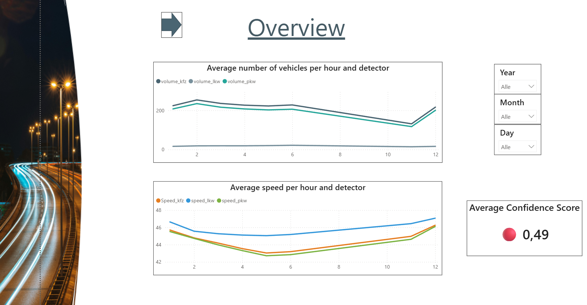

# 🚦 Berlin Traffic — KPI Confidence Platform

> **Most dashboards answer:** “What is the KPI?”
>
> **This project answers:** **“Can we trust this KPI?”**
>
> *Bridging the gap between data visibility and data reliability.*


The **KPI Confidence Platform** augments traditional BI by attaching a **Confidence Score (0–1)** to every KPI—derived from data quality, data integrity, time-series consistency, and ML-based anomaly detection.

---

## ⚙️ Tech Stack


---

## 🌐 Live Demo

👉 **Streamlit App (Demo Mode):**
https://kpi-confidence-platform-demo.streamlit.app/

> ⚠️ Full system runs locally (PostgreSQL + n8n + FastAPI).
> Streamlit Cloud runs in **demo mode** using prepared datasets.

---

## 🎯 Why This Project Matters

In real-world data systems:

* Missing data often goes unnoticed
* Pipeline issues remain hidden
* Anomalies silently distort KPIs

👉 This leads to **wrong decisions made with high confidence**

This project transforms analytics from:

❌ KPI reporting
to
✅ **Trust-aware and decision-ready systems**

---

## 🏗️ System Architecture

| Layer                | Responsibility               |
| -------------------- | ---------------------------- |
| n8n                  | Orchestration & control flow |
| FastAPI              | Internal API (n8n ↔ Python)  |
| Python Engine        | Data processing & ML         |
| PostgreSQL           | Storage, state, audit        |
| Slack                | Monitoring & alerting        |
| Streamlit / Power BI | Visualization                |

---

## 🔄 End-to-End Data Flow
```
Source (Berlin Open Data / Azure)
        ↓
Ingestion (n8n + FastAPI)   ← ETag / SHA-256 change detection
        ↓
Staging (PostgreSQL)
        ↓
Core / Analytics (Python Engine)
  → guardrail_validate (rc=42 skip)
  → phase_b_engine (KPI computation)
  → ml_anomaly_score (MAD)
        ↓
Confidence Scoring
        ↓
Output: Power BI / Streamlit / Slack
```

---

## 🧠 Smart Ingestion — Change Detection

A dedicated Python module decides whether a file should be ingested:

| Case           | Detection       | Action    |
| -------------- | --------------- | --------- |
| New file       | ETag differs    | Ingest    |
| Changed file   | SHA-256 differs | Re-ingest |
| Unchanged file | Both match      | Skip      |

👉 Prevents redundant processing and guarantees data integrity

---

## ⚙️ Orchestration with n8n

n8n acts as the **control layer**, not the processing engine.

### Workflow 1 – Ingestion

* Create ingestion run
* Generate month targets
* Call `/ingest` API
* Track file versions (`ingestion.file_history`)
* Send Slack alerts

<p align="center">
  <a href="assets/workflow_ingestion.jpg">
    
  </a>
</p>

---

### Workflow 2 – Pipeline Execution

* Query DB for new months
* Conditional execution
* Call `/run-pipeline`
* Execute Stage → Engine → ML ✅
* Send execution report

<p align="center">
  <a href="assets/workflow_pipeline.jpg">
    
  </a>
</p>

---

## 📣 Monitoring & Alerts

The platform includes automated monitoring and Slack-based alerting to ensure reliable pipeline operations.

It provides:

- Ingestion status tracking (new / unchanged / missing data)
- Pipeline execution reporting across all stages
- Guardrail validation and controlled error handling

 👉 Enables real-time observability of pipeline health

### 🔄 Ingestion Monitoring
<p align="center"> <a href="assets/slack_ingestion_alert.jpg">  </a> </p> <p align="center"> <sub>Detection of new, unchanged, and missing data during ingestion</sub> </p>
⚙️ Pipeline Monitoring
<p align="center"> <a href="assets/slack_pipeline_alert.jpg">  </a> </p> <p align="center"> <sub>Execution status, guardrails, and structured pipeline reporting</sub> </p>

---

## ⚙️ Pipeline Internals (Execution Engine)

**Execution Flow**
The pipeline is designed as a controlled, modular execution flow:

```
run_e2e
 → run_batch_pipeline
   → run_stage_loaders
   → register_file_manifest
   → guardrail_validate
   → phase_b_engine
   → ml_anomaly_score
```

---

### 🧩 Core Capabilities

- Idempotent ingestion using ETag & SHA256 manifest tracking  
- Batch-based processing (month-level execution)  
- Guardrail validation (`rc=42`) for safe, non-fatal skips  
- SQL-based deduplication using `DISTINCT ON`  
- End-to-end orchestration via Python engine  

---

### 🎯 Design Principles

- Deterministic execution  
- Failure isolation (no full pipeline crash)  
- Reproducibility of results  
- Controlled data quality enforcement  

---

## 🚀 Outcome

 👉 Enables **repeatable, failure-safe, and production-like pipeline execution**

---

## ♻️ Idempotency & Reliability

- Fully re-runnable pipeline  
- `--replace-month-slice` for safe reprocessing  
- Duplicate-safe logic  
- Guardrail prevents invalid data propagation  

👉 Production-ready behavior

---

## 🧾 Data Governance & Audit

- File-level tracking (ETag, SHA256)  
- Run-level tracking (`ingestion_runs`)  
- Decision tracking (ingested / skipped / failed)  

👉 Full audit trail for debugging and reproducibility

---

## 🤖 ML — Anomaly Detection

**Median Absolute Deviation (MAD)**

- Robust to noisy real-world data  
- Threshold: |z| > 3.5 → anomaly  

👉 Better suited than classic Z-score

---

## 📈 Confidence Scoring

Confidence Score (0–1) combines:

- Completeness  
- Consistency  
- Anomaly signals  
- Data integrity  

| Score       | Meaning   |
|------------|-----------|
| 0.85 – 1.00 | ✅ High   |
| 0.60 – 0.84 | ⚠️ Medium |
| < 0.60      | ❌ Low    |

---

## 📊 Consumption Layer — Decision vs Diagnostic

The platform separates business reporting from technical diagnostics to ensure clarity and avoid overlap.

### 🟢 Power BI — Decision & Management Layer

Designed for business stakeholders and decision-makers.

Provides:

- KPI trends (traffic flow, speed)  
- Aggregated performance indicators  
- Confidence score visualization  
- Visual decision support using an **Ampel system (High / Medium / Low)**  

👉 Focus:  
**"What is happening and can I trust this KPI?"**

<p align="center">
  <a href="assets/powerbi_overview.jpg">
    
  </a>
</p>

---

### 🔵 Streamlit — Data Quality & Diagnostic Layer

Designed for analysts and data engineers.

Enables:

- Deep-dive into KPI calculations  
- Inspection of data quality metrics  
- Analysis of anomaly signals (ML layer)  
- Root cause analysis for low-confidence KPIs  

👉 Focus:  
**"Why is this KPI unreliable?"**

👉 Streamlit is used as an **engineering tool**, not just a dashboard

---

## 🧪 Demo vs Full System

| Component | Demo    | Full System    |
|----------|--------|----------------|
| Data     | Static | Live ingestion |
| Database | ❌      | PostgreSQL     |
| n8n      | ❌      | ✔              |
| ML       | Limited| Full           |
| Alerts   | ❌      | Slack          |

---

## 🚧 Production Readiness

- Incremental ingestion (ETag/SHA256)  
- Idempotent batch design  
- Failure isolation (guardrail)  
- Monitoring via Slack  
- Config-driven execution  

👉 Ready for automation and scaling

---

## 👥 Team & My Role

Developed by a team of three.

**My contributions:**

- Designed & implemented **n8n workflows (orchestration layer)**  
- Developed **Streamlit application (UI + DB integration)**  
- Contributed to **PostgreSQL modeling**  
- Implemented parts of **pipeline orchestration & ingestion logic**

---

## 🔒 Security

- No `.env` files committed  
- Environment-based configuration  
- Raw data excluded from repository  

---

## 📫 Contact

- LinkedIn: https://www.linkedin.com/in/dorna-poursoheil-data  
- Location: Germany
